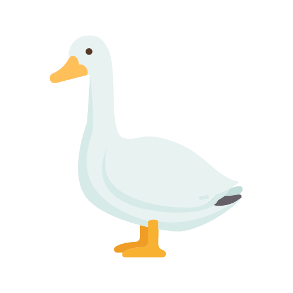

<p align="center">
  <a href="" rel="noopener">
 </a>
</p>

<h3 align="center">Goose programming language</h3>

<div align="center">

[]()
[](https://github.com/goose-language/goose/issues)
[](https://github.com/goose-language/goose/pulls)
[](/LICENSE)
 
</div>

---

<p align="center"> 
    Goose is a functional programming language that combines simplicity and productivity in addition to its cool and easy syntax.
    <br> 
</p>

## ⚡️ Features of Goose
 - [x] Strong typechecker
 - [x] Functional programming
    - [x] Pattern matching
    - [x] Higher order functions
    - [x] Surpowered enumerations
 - [x] Imperative programming
    - [x] Imperative-style loops
    - [x] Statements as expression
    - [x] Mutable variables
 - [x] Native compilation using CLang
 - [ ] bootstrap compiler
 - [x] scalable type system 
 - [x] powerful module system
 - [x] anonymous dictionaries

## 📝 Table of Contents

-   [About](#about)
-   [Manual installation](#manual)
-   [Build](#build)
-   [Getting started](./GUIDE.md)
-   [Usage](#usage)
-   [TODO](./TODO.md)
-   [Contributing](./CONTRIBUTING.md)
-   [Authors](#authors)
-   [Thanks](#thanks)

## 🧐 About <a name = "about"></a>

Goose is both a functional and imperative programming language that inherits from the best of both worlds. It syntax is highly inspired by the Ruby's one and it is designed to be easy to read and write.

Its main goal is to be a simple and productive language that can be used for both small and big projects.

## 🏁 Getting Started <a name = "getting_started"></a>

These instructions will get you a copy of the project up and running on your
local machine for development and testing purposes. See
[Manual installation](#manual) for notes on how to install the project on a live
system.

### Prerequisites

To install Goose, you will need:

```
GHC >= 8.10.x
Cabal >= 3.0.0
```

### Installing

---

## 🔧 Running the tests <a name = "tests"></a>

To run the tests:

```bash
 $ cabal test
 # OR in order to get test details
 $ cabal test --test-show-details=direct
```

<!-- ### And coding style tests

The linter is present in order to allow anyone to be able to contribute while
being in the main coherence of the code.

```
 deno lint
``` -->

## 🎈 Usage <a name="usage"></a>

No usage informations for the moment.

## 🚀 Manual installation <a name = "manual"></a>

To deploy Goose lang, do:

```bash
 $ git clone git@github.com:goose-language/goose.git

 # OR

 $ git init
 $ git remote add origin git@github.com:goose-language/goose.git
 $ git pull

```

## 🚀 Build <a name = "build"></a>

To build the project, do:

```bash
 $ cabal update
 $ cabal install
```
## ✍️ Authors <a name = "authors"></a>

-   [@thomasvergne](https://github.com/thomasvergne) - Idea & Initial work

<a href="https://github.com/goose-language/goose/graphs/contributors">
  
</a>

See also the list of
[contributors](https://github.com/goose-language/goose/contributors) who
participated in this project.